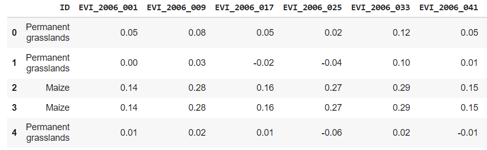

# Crop-classification

Welcome to crop classifier project, in this project i used entire france country crop details for all seasons using satlite data. and the datset contains more than 15 diffrent varity of crops agricultured in entire france. you can download the data set here in [Gdrive](https://drive.google.com/drive/folders/1PWK4LGJQHXJv5MAv1UN2XbAwJxS6vwYk?usp=sharing)

## The crops considered in the dataset 
* Permanent grasslands
* Maize
* Wheat
* Rapeseed
* Temporary grasslands
* Heathlands
* Barley
* Other cereals
* Protein crops
* Other oilseeds
* Sunflower
* Fallows
* Vegetables and Flowers
* Fiber plants
* Vineyards
* Rice
* Orchards
* Seeds
* Seed legumes
* Olive trees

## Data type

the data set has two types of data 
* NDVI
* EVI

And data for each crop for NDVI and EVI is collected over a period of year as shown below each crop is listed in rows and NDVI/EVI data is listed in columns (data is for randoms days from 1 to 365 days in a year)

# Models tested 

Below are the models tested on the dataset for crop classification

* K Nearest Neighbors
* Support vector machine
* Decision tree
* Random forest ensemble
* SGD classifier
* MLP classifier
* XGboost classifier

# Sample confusion matrix result

## Authors

* **Mallikarjun Sajjan**  - [mullermuttu](https://github.com/millermuttu)

